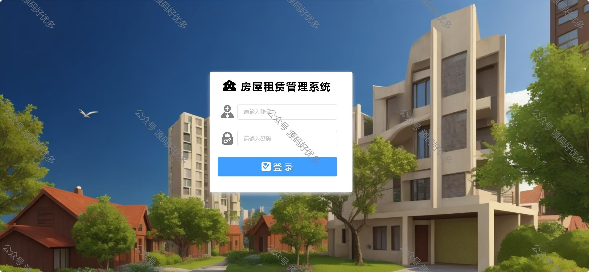
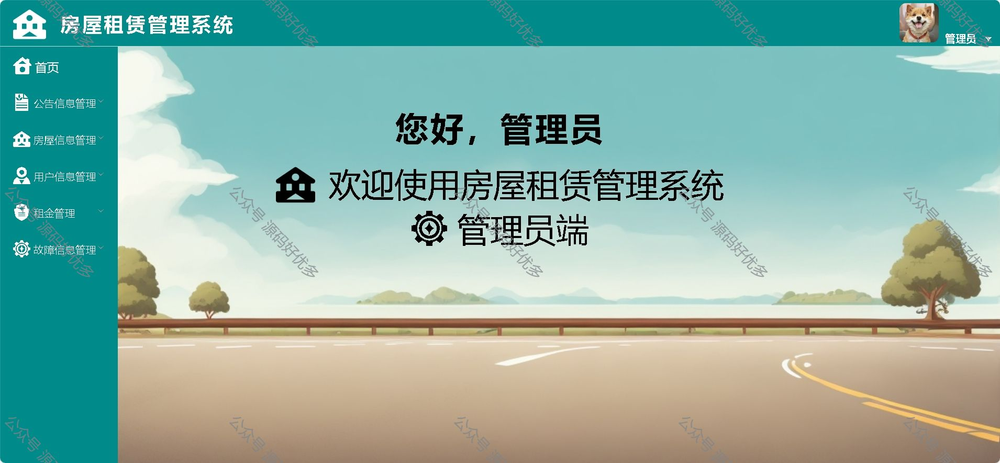
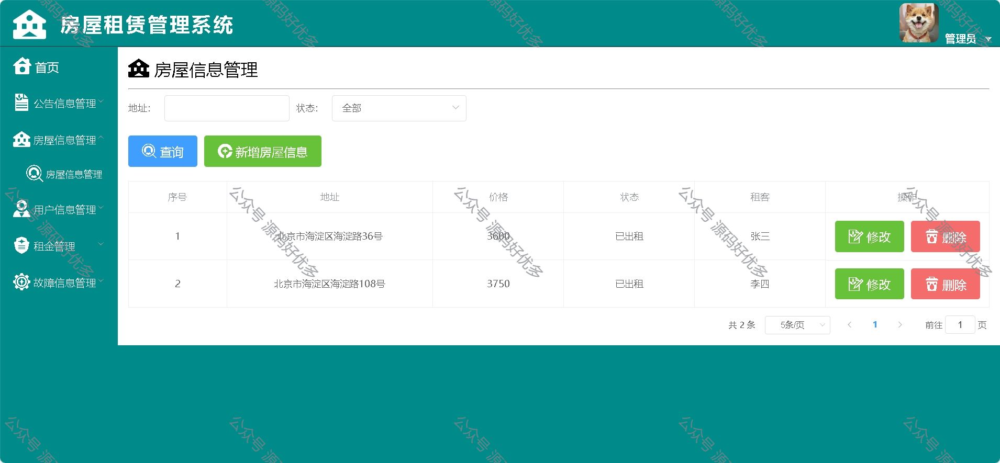
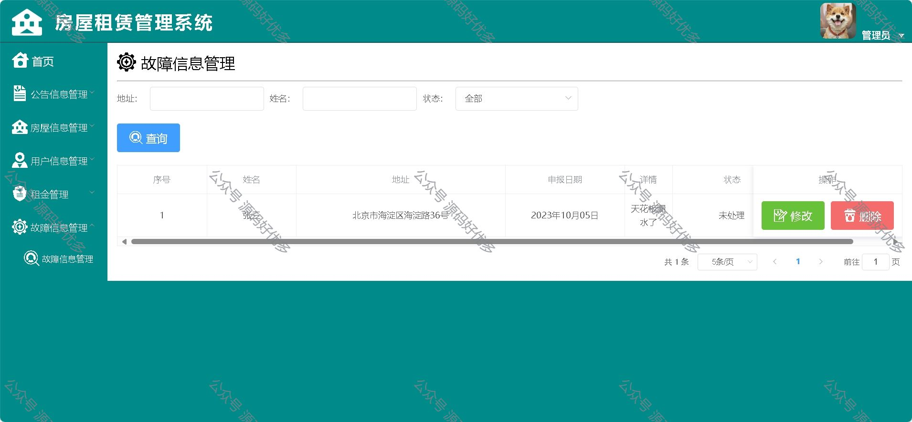
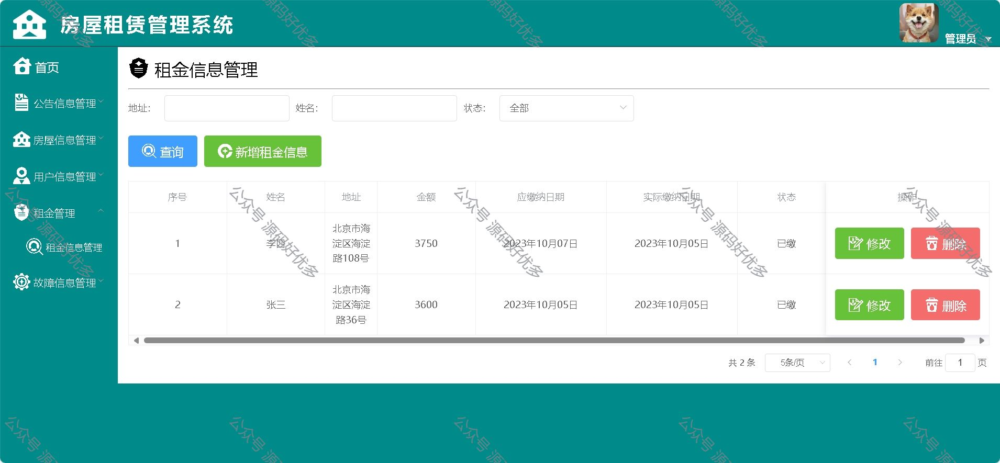
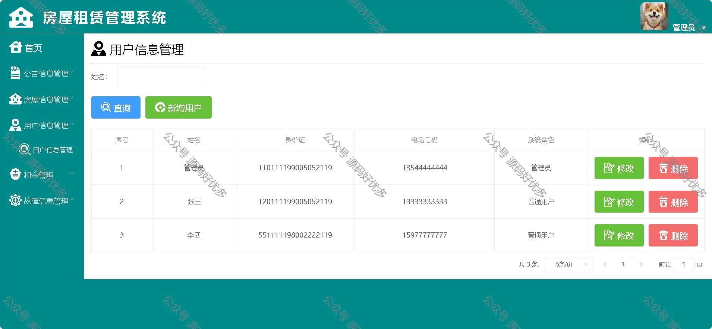
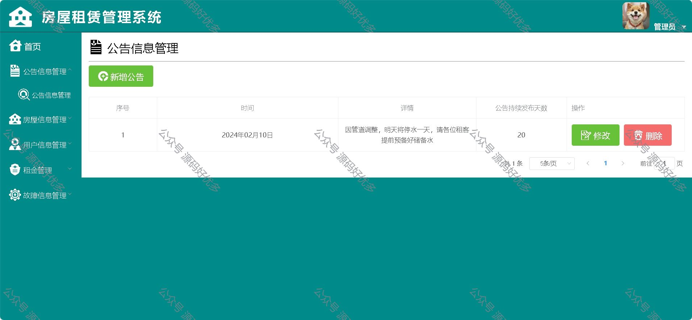
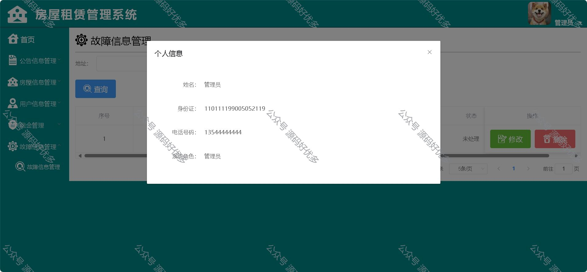
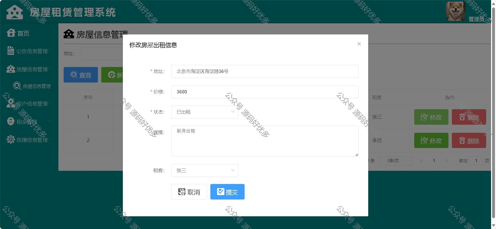
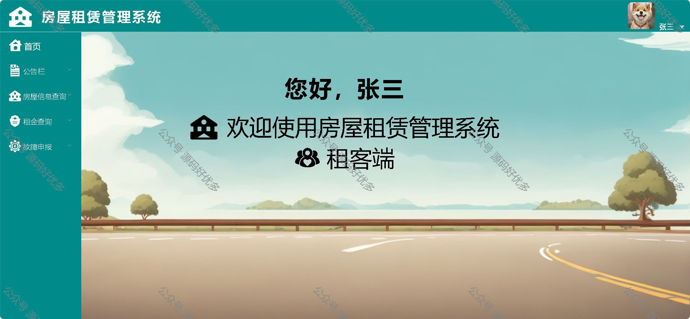

### 一、作品包含

源码+数据库+设计文档+全套环境和工具资源+部署教程

### 二、项目技术

前端技术：Html、Css、Js、Vue、Element-ui

数据库：MySQL

后端技术：Java、Spring Boot、MyBatis

### 三、运行环境

开发工具：IDEA/eclipse

数据库：MySQL8.0

数据库管理工具：Navicat10以上版本

环境配置软件： JDK1.8+Maven3.6.3

前端Nodejs：16

### 四、项目介绍

项目编号：springbootA019

用户端功能：修改密码、个人信息查看、查看公告、房屋信息、租金信息、故障维修申报。
管理员端功能：修改密码、个人信息查看、公告管理、房屋管理、用户管理、租金管理、故障维修管理。

### 五、运行截图

